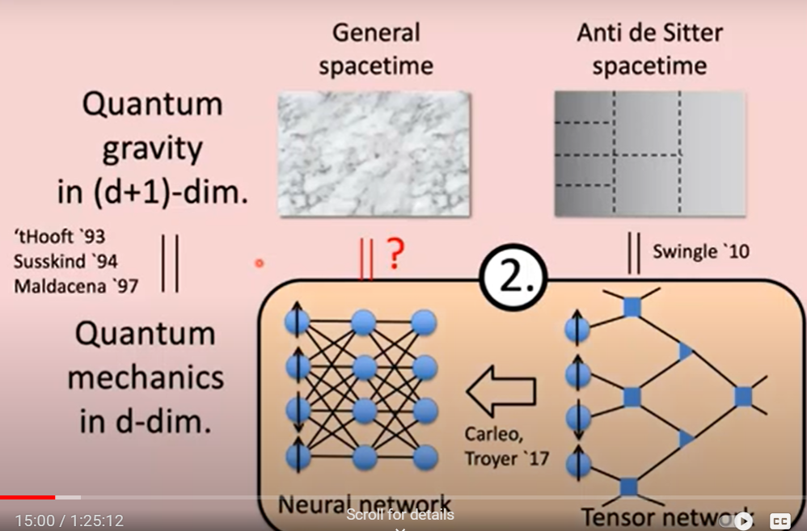

# Deep-Learning-for-Quantum-Foundations
Deep neural networks for many body quantum many body systems, quantum gravity and quantum foundations.

## Quantum Many Body Systems and Deep Learning

**Carleo, Giuseppe**, and Matthias Troyer. "Solving the quantum many-body problem with artificial neural networks." Science 355, no. 6325 (2017): 602-606.
https://www.science.org/doi/full/10.1126/science.aag2302

https://www.netket.org/posts/3-unitaryhack/ . The Machine-Learning toolbox for Quantum Physics

https://pypi.org/project/NetKet/ . Netket : Machine Learning toolbox for many-body quantum systems.

Neural network trained to solve quantum mechanical problems
https://arstechnica.com/science/2017/02/neural-network-trained-to-solve-quantum-mechanical-problems/#:~:text=Trained%20on%20quantum%20mechanics%2C%20the%20network%20handles%20multi-body%20wavefunctions.&text=A%20quantum%20many-body%20spin,complicated%20interactions%20among%20the%20particles.&text=It's%20notoriously%20difficult%20to%20make,behavior%20of%20many%20quantum%20systems
Two researchers at ETH Zurich, named Giuseppe Carleo and Matthias Troyer, have provided a third option: set a neural network loose on quantum mechanics.

An intriguing part of their approach is that they rely on an architecture that mimics an idea about 
quantum mechanics we're pretty sure is wrong: hidden variables. Quantum mechanics allows what Einstein 
had derided as "spooky action at a distance," where things done to one particle can influence an 
entangled partner no matter the distance between the pair. One possible explanation for this is that 
there are properties of the particles that we can't currently measure—the so-called hidden 
variables—that explain this behavior. But hidden variables have largely been eliminated by 
experiments over the last decade or so.

They make a reappearance in Carleo and Troyer's neural network, at least in terms of architecture. 
For this work, the experiments all focused on particle spin; in a multi-particle quantum system, 
these spins interact in complicated ways (for more about these interactions, see the section on 
Ising models in our look at D-Wave's quantum computer). The neural network used here had one 
collection of nodes that simply represented the spin of the particles in the simulation.

But backing that collection of nodes is something the authors call a "hidden layer." Each of the 
visible spin nodes was backed by a number of hidden ones, which helped extract features from known 
wavefunctions. And each of these hidden nodes could influence the state of multiple visible ones. 
In the work described here, Carleo and Troyer set it up so that each visible node has an average 
of four hidden ones backing it. But they point out that, if computational resources become less 
of an issue, it would easily be possible to scale the architecture simply by adding more hidden 
nodes.

The other nice thing about this architecture is that it's inherently non-local. Individual hidden nodes can have connections with nodes representing the spin of particles that are physically separated. Since quantum mechanics is also non-local, this may help the neural network represent the underlying physics.

Neural networks need to be trained, which poses a bit of a challenge in that we don't have any exact solutions to a many-body wavefunction against which to train the networks. Still, there are instances where the other two computational approaches described above work well, so they were used to provide reinforcement learning. The results were quite promising. For two different classes of problems, the neural network learned patterns related to the underlying physics. And, in each case, it was able to match or exceed the performance of existing computational methods.

Carleo and Troyer are optimistic about this approach. More recent neural network architectures, like deep networks, are showing some impressive performance, and it should be possible to apply them to quantum mechanics. It should also be trivial to get this approach to handle quantum behavior beyond particle spins. The real test, though, will be to apply the neural network approach to problems where the other two methods come up short in some cases (though not all, or we'd have nothing to train it with). Figuring out whether it produces physically plausible results in these cases can be left as a challenge for the experimentalists.

Torlai, Giacomo, Guglielmo Mazzola, Juan Carrasquilla, Matthias Troyer, Roger Melko, and Giuseppe Carleo. "Neural-network quantum state tomography." Nature Physics 14, no. 5 (2018): 447-450.
https://www.nature.com/articles/s41567-018-0048-5

Carrasquilla, Juan, Giacomo Torlai, **Roger G. Melko**, and Leandro Aolita. "Reconstructing quantum states with generative models." Nature Machine Intelligence 1, no. 3 (2019): 155-161.
https://www.nature.com/articles/s42256-019-0028-1

Carrasquilla, Juan, and Roger G. Melko. "Machine learning phases of matter." Nature Physics 13, no. 5 (2017): 431-434.
https://www.nature.com/articles/nphys4035

Wood, Charlie, Quantum Complexity Tamed by Machine Learning, 2022. 
https://www.quantamagazine.org/quantum-complexity-tamed-by-machine-learning-20220207/

If scientists understood exactly how electrons act in molecules, they’d be able to predict the behavior of everything from experimental drugs to high-temperature superconductors. Following decades of physics-based insights, artificial intelligence systems are taking the next leap.

DFT gives scientists a powerful shortcut for predicting where electrons will go and, by extension, how atoms, molecules and other objects clothed in electrons will act. Physicists and chemists have long drawn on deep physical expertise to make their equations better reflect the intricate dance common to all electrons. But recently, new tools designed by neural networks are rivaling and, in some ways, outperforming their hand-crafted forerunners. Some researchers now believe machine learning could help researchers take larger and faster steps toward a master electron equation that would unlock the secrets of novel drugs, superconductivity and exotic materials.
“These machine learning methods,” said Marivi Fernández-Serra, a condensed matter physicist at Stony Brook University, “they got to where the field was in a couple of years and have already surpassed it.”

#### Create: Deep Neural Networks for Many Body Quantum Systems

##### Deep neural networks for many body electronic wavefunctions.

Logic: 

* DNN are ultra successful "quantum chemistry" wavefunctions (NetKet . . . ).

* Then, if DNN so successful, might say that quantum wavefunction is in fact a DNN (not just an approximation function).

* If quantum systems are DNN, then has implications for reality: hidden variables, retrocausal (quote from Autodidactic)

* Broader views
	** DNN as quantum chemistry (NetKet, FermiNet, . . . )

	** DNN and Quantum Gravity (ADS/CFT, Hashimoto, Cao/Bao, . . . )

	** DNN as cosmic laws (Autodidactic, Sabine/Bobby, . . . ) 

##### Deep Neural Networks for ADS/CFT Quantum Graivty

##### Deep Neural Networks for Quantum Foundations

##### Deep Neural Networks for Cosmological Foundations (Laws of Physics as ML)

## Cosmological Learning

Alexander, Stephon, William J. Cunningham, Jaron Lanier, Lee Smolin, Stefan Stanojevic, Michael W. Toomey, and Dave Wecker. "The autodidactic universe." arXiv preprint arXiv:2104.03902 (2021).
https://arxiv.org/abs/2104.03902.     

(When a model becomes sufficiently good at mirroring observable reality, it becomes natural to ask if it could be considered as if it were an aspect of reality, not just an approximation. A sense that models are substantial motivated the discovery of
previously unsuspected phenomena, such as antimatter, which was predicted because
of the available solutions to an equation. We are extending Wigner’s trust given to
the ”unreasonable” success of theory. If neural networks can predict or rediscover
the theories we know about, might nature not be as similar to the neural networks as
to the theories?)   

Azarian, Bobby. The case for why our Universe may be a giant neural network. https://bigthink.com/hard-science/the-universe-may-be-a-giant-neural-network-heres-why/

Neuroscientist and author Bobby Azarian explores the idea that the Universe is a self-organizing system that evolves and learns.

Vazza, Franco, and Alberto Feletti. "The quantitative comparison between the neuronal network and the cosmic web." Frontiers in Physics 8 (2020): 491.
https://www.frontiersin.org/articles/10.3389/fphy.2020.525731/full?trk=public_post_comment-text

All brain samples analysed in this work, as well as relevant samples of the simulated cosmic web 
and the reconstructed network connectivity are publicly accessible at 
this URL: https://cosmosimfrazza.myfreesites.net/cosmic-web-and-brain-network-datasets.     

Buckareff, Andrei A. Pantheism. Cambridge University Press, 2022.

SABINE HOSSENFELDER, Maybe the Universe Thinks. Hear Me Out, TIME, AUGUST 25, 2022
https://time.com/6208174/maybe-the-universe-thinks/

## Spacetime from Quantum Wavefunction

Cao, ChunJun. "Towards a Theory of Quantum Gravity Through Geometrization of Quantum Mechanics." PhD diss., California Institute of Technology, 2018.
https://thesis.library.caltech.edu/10860/

Nilsson, Torbjörn. "Road to Emergent Spacetime." (2019).
https://odr.chalmers.se/items/106b783d-b06a-4545-8969-c19ae61fcbf2

Bao, Ning, ChunJun Cao, Sean M. Carroll, and Liam McAllister. "Quantum circuit cosmology: The expansion of the universe since the first qubit." arXiv preprint arXiv:1702.06959 (2017).
https://arxiv.org/abs/1702.06959

Cao, ChunJun, and Sean M. Carroll. "Bulk entanglement gravity without a boundary: Towards finding Einstein’s equation in Hilbert space." Physical Review D 97, no. 8 (2018): 086003.
https://journals.aps.org/prd/abstract/10.1103/PhysRevD.97.086003

## Deep Learning and ADS/CFT Holography Quantum Gravity

Gan, Wen-Cong, and Fu-Wen Shu. "Holography as deep learning." International Journal of Modern Physics D 26, no. 12 (2017): 1743020.
https://www.worldscientific.com/doi/abs/10.1142/S0218271817430209

Hashimoto, Koji, Sotaro Sugishita, Akinori Tanaka, and Akio Tomiya. "Deep learning and holographic QCD." Physical Review D 98, no. 10 (2018): 106014.
https://journals.aps.org/prd/abstract/10.1103/PhysRevD.98.106014

Our deep learning (DL) architecture is based on the AdS/DL correspondence [K. Hashimoto, S. Sugishita, A. Tanaka, and A. Tomiya, Phys.
Rev. D 98, 046019 (2018)] where the deep neural network is identified with the emergent bulk spacetime.

Hashimoto, Koji, Sotaro Sugishita, Akinori Tanaka, and Akio Tomiya. "Deep learning and the AdS/CFT correspondence." Physical Review D 98, no. 4 (2018): 046019.
https://journals.aps.org/prd/abstract/10.1103/PhysRevD.98.046019

https://www.youtube.com/watch?v=vnMC-InCS1Y
https://www.youtube.com/watch?v=3XQDGAbPyw0
https://www.youtube.com/watch?v=StmIbDxnMwc

Hashimoto, Koji. "AdS/CFT correspondence as a deep Boltzmann machine." Physical Review D 99, no. 10 (2019): 106017.
https://journals.aps.org/prd/abstract/10.1103/PhysRevD.99.106017

Akutagawa, Tetsuya, Koji Hashimoto, and Takayuki Sumimoto. "Deep learning and AdS/QCD." Physical Review D 102, no. 2 (2020): 026020.
https://journals.aps.org/prd/abstract/10.1103/PhysRevD.102.026020

## Quantum Gravity

Loll, R., G. Fabiano, D. Frattulillo, and F. Wagner. "Quantum gravity in 30 questions." arXiv preprint arXiv:2206.06762 (2022).
https://arxiv.org/abs/2206.06762

Smolin, Lee. Time Reborn: From the crisis in physics to the future of the universe. HMH, 2013.
	Theory from Quantum Hidden Variables to Shape Dynamics, Chapter 12: Quantum Mechanics and the Liberation of the Atom, Chapter 13: The Battle Between Relativity and the Quantum, Chapter 14: Time Reborn from Relativity. Outlines future mapping between GR<->ShapeDynamics and Holographic-Principle

Mercati, Flavio. Shape dynamics: Relativity and relationalism. Oxford University Press, 2018.

## Transactional Interpretation of Quantum Mechanics

Cramer, John G. "The transactional interpretation of quantum mechanics." Reviews of Modern Physics 58, no. 3 (1986): 647.
https://journals.aps.org/rmp/abstract/10.1103/RevModPhys.58.647

Cramer, John G. "An overview of the transactional interpretation of quantum mechanics." International Journal of Theoretical Physics 27 (1988): 227-236.

Cramer, John G. "The transactional interpretation of quantum mechanics." In AIP Conference Proceedings, vol. 573, no. 1, pp. 132-138. American Institute of Physics, 2001.

Kastner, Ruth E. The Transactional Interpretation of Quantum Mechanics: A Relativistic Treatment. Cambridge University Press, 2022.

Kastner, R. E. "The Relativistic Transactional Interpretation and Spacetime Emergence." arXiv preprint arXiv:2103.11245 (2021).
https://arxiv.org/abs/2103.11245

Mason, Peter Stuart. "The transactional interpretation of quantum mechanics." Journal of Critical Realism 16, no. 1 (2017): 90-95.

Cramer, John Gleason, and Carver Andress Mead. "Symmetry, transactions, and the mechanism of wave function collapse." Symmetry 12, no. 8 (2020): 1373.
https://www.mdpi.com/2073-8994/12/8/1373    

https://www.npl.washington.edu/AV/altvw16.html

Fearn, H. "A delayed choice quantum eraser explained by the transactional interpretation of quantum mechanics." Foundations of Physics 46 (2016): 44-69.

Mead, Carver A. "Collective Electrodynamics I." In Feynman And Computation, pp. 29-43. CRC Press, 2018.

https://www.amazon.com/dp/1009303864/ref=sspa_dk_detail_0?psc=1&pd_rd_i=1009303864&pd_rd_w=e1y3J&content-id=amzn1.sym.eb7c1ac5-7c51-4df5-ba34-ca810f1f119a&pf_rd_p=eb7c1ac5-7c51-4df5-ba34-ca810f1f119a&pf_rd_r=N7KBCY9Y4B92J0H63B3H&pd_rd_wg=rKCbA&pd_rd_r=ebae092a-e4a0-472b-a9b6-2d971d4ca2f7&s=books&sp_csd=d2lkZ2V0TmFtZT1zcF9kZXRhaWw

https://www.amazon.com/Quantum-Field-Theory-Simply-Possible/dp/0691174296/ref=pd_sim_d_sccl_2_1/135-8200158-7787618?pd_rd_w=nhqDu&content-id=amzn1.sym.95c9984b-e881-4eb8-9a85-bd9add50dfd7&pf_rd_p=95c9984b-e881-4eb8-9a85-bd9add50dfd7&pf_rd_r=N7KBCY9Y4B92J0H63B3H&pd_rd_wg=rKCbA&pd_rd_r=ebae092a-e4a0-472b-a9b6-2d971d4ca2f7&pd_rd_i=0691174296&psc=1

https://www.amazon.com/Superfluid-Universe-Kerson-Huang/dp/B073MDN98K/ref=pd_sbs_d_sccl_1_1/135-8200158-7787618?pd_rd_w=3kxGN&content-id=amzn1.sym.89676150-e513-422e-84a9-9c8b85f32b61&pf_rd_p=89676150-e513-422e-84a9-9c8b85f32b61&pf_rd_r=KQSA6JFW39QM0AZSSZ0B&pd_rd_wg=J0Kax&pd_rd_r=c28d15b1-8b68-402a-8f8b-d73f68250152&pd_rd_i=B073MDN98K&psc=1

Mead, Carver, Collective Electrodynamics: Quantum Foundations of Electromagnetism, 2016
https://www.amazon.com/Collective-Electrodynamics-Quantum-Foundations-Electromagnetism/dp/0262133784/ref=sr_1_3?qid=1704190710&refinements=p_27%3ACarver+Mead&s=books&sr=1-3

Forgione, Marco. "History and Philosophy of Feynman's Electrodynamics: From the Absorber Theory of Radiation to Feynman Diagrams." PhD diss., University of South Carolina, 2022.
https://www.proquest.com/openview/11b32a1291e3649bdda6ee7b5f84ae7b/1?pq-origsite=gscholar&cbl=18750&diss=y

Forgione, Marco. "The philosophical underpinning of the absorber theory of radiation." Studies in History and Philosophy of Science Part B: Studies in History and Philosophy of Modern Physics 72 (2020): 91-106.

Cramer, John G. "Generalized absorber theory and the Einstein-Podolsky-Rosen paradox." Physical Review D 22, no. 2 (1980): 362.

Wüthrich, Adrian. The genesis of Feynman diagrams. Vol. 26. Springer Science & Business Media, 2010.

Forgione, Marco. "Feynman's space-time view in quantum electrodynamics." Studies in History and Philosophy of Science 93 (2022): 136-148.

Cramer, John G. "The arrow of electromagnetic time and the generalized absorber theory." Foundations of Physics 13 (1983): 887-902.

Davies, Paul Charles William, and Paul Davies. About time: Einstein's unfinished revolution. Simon and Schuster, 1996.

## Deep Learning and Quantum Foundations

Bharti, Kishor, Tobias Haug, Vlatko Vedral, and Leong-Chuan Kwek. "Machine learning meets quantum foundations: A brief survey." AVS Quantum Science 2, no. 3 (2020).
https://pubs.aip.org/avs/aqs/article-abstract/2/3/034101/997289/Machine-learning-meets-quantum-foundations-A-brief?redirectedFrom=fulltext

VII. NEURAL NETWORKS AS “HIDDEN" VARIABLE MODELS FOR QUANTUM SYSTEMS

Understanding why deep neural networks work so well is
an active area of research. The presence of the word “hidden”
for hidden variables in quantum foundations and hidden neurons
in deep learning neurons may not be that accidental. Using
conditional Restricted Boltzmann machines (a variant of
Restricted Boltzmann machines), Steven Weinstein provides
a completion of quantum theory in reference [146]. The completion,
however, doesn’t contradict Bell’s theorem as the assumption
of “statistical independence” is not respected. The
statistical independence assumption demands that the complete
description of the system before measurement must be
independent of the final measurement settings. The phenomena
where apparent nonlocality is observed by violating statistical
independence assumption is known as “nonlocality without
nonlocality” [147].

Weinstein, Steven. "Nonlocality without nonlocality." Foundations of Physics 39, no. 8 (2009): 921-936.
https://link.springer.com/article/10.1007/s10701-009-9305-x

Weinstein, Steven. "Learning the Einstein-Podolsky-Rosen correlations on a restricted Boltzmann machine." arXiv preprint arXiv:1707.03114 (2017).
https://arxiv.org/abs/1707.03114

Wharton, K. B., and N. Argaman. "Colloquium: Bell’s theorem and locally mediated reformulations of quantum mechanics." Reviews of Modern Physics 92, no. 2 (2020): 021002.
https://journals.aps.org/rmp/abstract/10.1103/RevModPhys.92.021002

Weinstein, Steven. "Boltzmann machines as thermal models for quantum systems." arXiv preprint arXiv:1807.03910 (2018, 2021).
https://arxiv.org/abs/1807.03910

We successfully model the behavior of two-spin systems using neural networks known as conditional 
Restricted Boltzmann Machines (cRBMs) which encode physical information in the properties of a 
thermal ensemble akin to an Ising model. The result gives local ***"hidden" variable models*** for 
product states and entangled states, including the singlet state used in the EPR-Bohm experiment. 
Bell's theorem is circumvented because the state of the system is dependent not only on the preparation 
but also on the measurement setup (the detector settings). Though at first glance counterintuitive, 
the apparent **"retrocausality"** in these models has a historical **precedent in the absorber theory of 
Wheeler and Feynman**.

Weinstein, S. "Neural Networks as" hidden" variable models for quantum systems. eprint." arXiv preprint arXiv:1807.03910 (2018).
https://www.semanticscholar.org/paper/Neural-networks-as-%22hidden%22-variable-models-for-Weinstein/8a5a66c890c14a0253e1d257b50c1a959b8c8912
